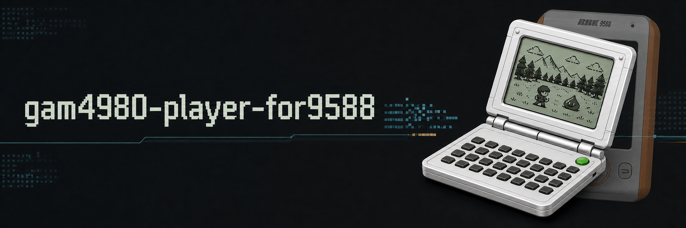

# gam4980-player-for9588

将 GPLv3 `gam4980` 模拟器核心移植到 BBK 9588。

本项目与 SDK 示例相互独立。它会构建一个拥有独立入口、图标、系统文件
选择器和 9588 裸机载荷的 `GAM4980.BDA`，不会读取或修改其他 BDA 作为
模板。载荷只使用 `sdk/` Git 子模块 `sdk/sdk/include` 中的正式头文件，
构建过程不访问父级目录，也不依赖研究头文件或 `reverse` 目录。

## 运行预览


## 运行要求

- 仓库已按设备目录结构提供 `8.BIN` 和 `E.BIN`：

  ```text
  应用\数据\游戏\gam4980\8.BIN
  应用\数据\游戏\gam4980\E.BIN
  ```

  部署时将仓库根目录下的 `应用` 目录合并到设备 `A:\`，
  最终路径为：

  ```text
  A:\应用\数据\游戏\gam4980\8.BIN
  A:\应用\数据\游戏\gam4980\E.BIN
  ```

- 初始化 `sdk` 子模块，并使用子模块提供的工具链安装脚本。
- SDK 子模块的正式头文件需要包含已验证的堆内存、文件定位、系统文件
  选择器、窗口生命周期、原始 RGB565 图片、离屏 compatible context 和矩形复制 API。

除上述两个已白名单收录的运行时文件外，其他固件镜像、游戏、
存档、打包后的 BDA 和生成文件仍不应提交到仓库。

将 `.gam` 游戏文件放在：

```text
A:\gam4980\
```

## 构建

在本项目根目录执行：

```powershell
git submodule update --init sdk
.\sdk\scripts\setup_toolchain.ps1
python .\build.py
```

仓库内的 `应用` 目录树可直接作为 NAND 或设备文件部署输入，
后续构建和安装无需再从外部附件查找这两个 ROM。
要生成可直接覆盖到 9588 的安装包，执行：

```powershell
python .\build.py --output ".\应用\程序\GAM4980.BDA"
python .\package_release.py
```

输出为 `build\gam4980-player-for9588.zip`，其中只包含：

```text
应用/程序/GAM4980.BDA
应用/数据/游戏/gam4980/8.BIN
应用/数据/游戏/gam4980/E.BIN
```

解压 ZIP 后将 `应用` 目录覆盖到 9588 的 `A:\`。

## GitHub Actions

`.github/workflows/build-release.yml` 会在 `main` push、pull request、tag
push 和手动触发时构建 BDA 和安装 ZIP，并分别上传两个构建产物。push 任意
tag 后，工作流还会自动创建同名 GitHub Release，并附加
`gam4980-player-for9588.zip` 和 `GAM4980.BDA`。同一 tag 的工作流重跑会覆盖
已有 Release 附件。

例如发布 `v0.1.0`：

```powershell
git tag -a v0.1.0 -m "v0.1.0"
git push origin v0.1.0
```

SDK 子模块是公开仓库。工作流直接使用 `.gitmodules` 中的 HTTPS URL 检出
固定提交，不需要配置 deploy key 或 Actions secret，fork 后也可以直接构建。

应用通过正式 API `bda_gui_select_file()` 打开固件系统文件选择器。选择器
默认进入 `A:\gam4980\`，并只显示 `.gam` 文件。选中的游戏会直接流式写入
模拟闪存，因此不需要额外分配一个与游戏等大的堆缓冲区。

## 渲染与时序

- 模拟器按照上游的 60 Hz 频率运行。9588 主循环为 40 Hz，以
  `1、2、1、2` 的节奏调度核心帧。每个主机周期先补齐全部核心帧，再只读取
  一次当前 LCD 状态；GUI 调用超时后也只提交追时后的最新状态，不保存、排队
  或重放历史帧。因此片头动画中的过渡画面不会被额外延长，输入也不会被旧
  动画阻塞。
- 写入 LCD RAM 时会设置脏标记。未发生变化的帧不会执行 RGB565 转换，也
  不会提交到 GUI。当前 LCD 只有在需要提交时才展开为 RGB565。
- 有效 LCD 分辨率为 159x96，通过软件缩放到 240x145。LCD 与触摸按键之间
  的齿轮按钮可打开分类设置，选择最近邻、双线性或原始分辨率显示，默认使用
  双线性；齿轮左侧的键盘/手柄图标用于切换游戏控制面板与软键盘，再左侧的
  文件夹图标用于重选游戏。软键盘模式会显示 `FN/ABC` 分页按钮，分别进入
  原机功能键页和字母数字键页。中间栏不显示缩放名称。
  原始分辨率模式会将未经缩放的 159x96 画面居中放入 240x145 显示区。
  设置中还可以启用绿色、蓝色或黄色 LCD 主题，以及 LCD 残影；两项默认
  均关闭，关闭颜色主题时使用原始灰白配色。
  缩放模式使用的坐标映射在启动时只计算一次。240x145 动态画面和 240x320
  完整界面分别保存在原始 RGB565 缓冲区中，不依赖固件图片缩放。
- 每一帧先通过正式 `bda_gui_render_picture()` 完整写入 compatible back context，
  再在一次固件绘图保护范围内通过 `bda_gui_context_copy()` 提交到可见绘图
  上下文。C200 的这条 compatible-to-visible 路径会把 `0` 当作 RGB565 黑色色键，
  因此提交使用画面中不会出现的洋红色键，避免黑色笔画被跳过。可见上下文不会
  接触正在缩放或正在逐行写入的 CPU 缓冲区，从而避免显示扫描读到半帧。创建
  界面或修改设置时提交完整的 240x320 画面；普通更新只复制 240x145 LCD 显示区，
  限制双缓冲的额外带宽。
- LCD 解包器使用 16 项半字节查找表和对齐的 32 位写入。
- LCD 残影在最终显示阶段处理，消失的像素约用三个 25 ms 主机时隙淡出，
  新出现的像素立即显示；关闭残影时不会执行额外的逐像素混合。
- CPU 进入 HALT 后会直接推进到下一个定时器事件，不会逐条解释空闲周期。
- 只有模拟存档区实际发生变化后，才会将闪存存档写入文件系统。

8013 模拟器回归会检查片头动画、设置页、帮助页、重新启动和退出路径，并确认
没有无效 GUI 调用、绘图上下文恢复或重复静态提交。模拟器结果不代表真机性能。

## 操作方式

- 方向键：模拟方向键
- 确认键：模拟 Enter
- 短按退出键：模拟 Exit
- 长按退出键一秒：关闭模拟器
- 触摸游戏控制面板：方向键、Enter、Exit、Page Up 和 Page Down
- 软键盘：数字、QWERTY 字母、空格、输入法、中英、Help、Search、Insert、
  Modify、Delete、Exit 和 Enter
- 功能键盘：在软键盘模式点击 `FN`，可使用开关、目录、双解、现代/十万、
  汉英、对话、下载、发音，以及 Help、Search、Insert、Modify、Delete、
  Exit、Enter、Page Up 和 Page Down；点击 `ABC` 返回字母数字键盘
- 触摸连发：方向、Page Up、Page Down、字母、数字、空格和 Delete 在按住
  300 ms 后开始连发，此后每 75 ms 触发一次。Enter、Exit、功能键和界面
  按钮只触发一次
- 面板切换：点击齿轮左侧的键盘或游戏控制器图标；应用会记住最后使用的
  游戏控制面板或软键盘，首次运行默认显示游戏控制面板
- 帮助：点击重新选择游戏按钮左侧的问号，打开固件系统帮助页。帮助页包含
  操作说明、全部设置选项、存档位置、核心与移植作者信息以及讨论群号
- 设置：点击齿轮按钮。设置面板分为 `DISPLAY` 和 `GAME` 两个
  页签；方向键左/右切换页签，上/下选择项目，Enter 修改，也可以直接触摸。
  `COLOR` 在关闭、绿色、蓝色、黄色之间循环，`GHOST` 控制 LCD 残影；
  Exit 或面板的 X 按钮可关闭设置。
- 重新启动：选择 `RESTART GAME`，应用会先写回当前 `.sav`，完整释放当前
  模拟器会话，然后使用同一个 `.gam` 路径重新初始化。
- 更换游戏：点击工具栏中键盘/手柄切换按钮左侧的文件夹图标，并在系统
  中文确认框中选择“是”。应用会在当前会话保存并释放后重新打开
  `A:\gam4980\` 文件选择器；确认框选择“否”会直接返回当前游戏，文件
  选择器中取消选择则会重新启动原游戏。
- 游戏结束：`.gam` 主动退出后，模拟器停止执行核心并立即保存存档，在 LCD
  区域显示“游戏已退出”。此时仍可通过文件夹按钮重选游戏、通过设置重新
  启动，或短按实体/虚拟 `EXIT` 退出应用。

选择的缩放算法、游戏控制面板/软键盘模式、LCD 颜色主题和残影保存在：

```text
A:\应用\数据\游戏\gam4980\GAM4980.CFG
```

配置文件不存在或对应字段无效时，会回退到双线性缩放、游戏控制面板、
原始灰白配色和关闭残影。配置文件使用 8 字节格式；旧版本创建的 10 字节
配置文件仍可读取，末尾两个旧音频字段会被忽略。

存档与游戏文件放在同一目录并使用相同的主文件名。例如
`A:\gam4980\伏魔记.gam` 对应 `A:\gam4980\伏魔记.sav`。

## 上游项目

核心源码来自：

- <https://codeberg.org/iyzsong/gam4980>
- 上游提交 `36ce6d076d1103fa4a48e9e775cee28c31c03480`

模拟器核心继续采用 GPLv3 许可证，详见 `COPYING`。
